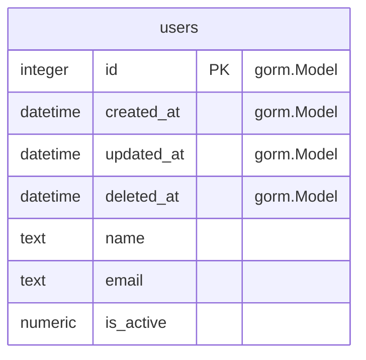
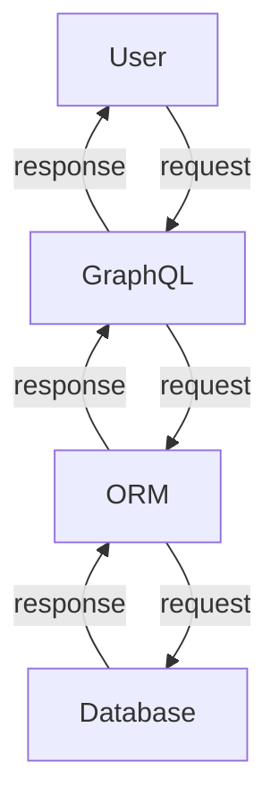

# graphql-playground.go
[GraphQL](https://graphql.org/) Playground written by [Go](https://go.dev/).


## Usage
```console
$ make server
```
- http://localhost:8080/

## Example


### CREATE
```graphql
mutation createUser {
  createUser(input: {
    name: "name-f",
    email: "f@xxx.com",
    is_active: true
  }) {
    id
    name
    email
    is_active
  }
}
```

### READ
```graphql
query readUser {
  user(is_active: true) {
    id
    name
    email
    is_active
  }
}
```

### UPDATE
```graphql
mutation updateUser {
  updateUser(input: {
    id: 1,
    name: "name-a",
    email: "a@xxx.com",
    is_active: false
  }) {
    id
    name
    email
    is_active
  }
}
```

### DELETE
```graphql
mutation deleteUser {
  deleteUser(input: {
    id: 7
  }) {
    id
    name
    email
    is_active
  }
}
```

## Development

```console
.
├── .gitignore : system
├── dev.db : human
├── go.mod : system
├── go.sum : system
├── gqlgen.yml : system
├── graph : system
│   ├── generated.go : system
│   ├── helper.go : human
│   ├── model : system
│   │   └── models_gen.go : system
│   ├── resolver.go : human
│   ├── schema.graphqls : human
│   └── schema.resolvers.go : system/human
├── LICENSE : system
├── Makefile : human
├── migrate.go : human
├── README.md : human
├── server.go : system
└── tools.go : system
```

### GraphQL
- [gqlgen](https://github.com/99designs/gqlgen)

### ORM
- [gorm](https://github.com/go-gorm/gorm)

### Database
- [SQLite](https://sqlite.org/index.html)

### Command
- generate
  ```console
  $ make generate
  ```

- [migrate](https://github.com/ghsable/graphql-playground.go/blob/main/migrate.go)
  ```console
  $ make migrate
  ```
